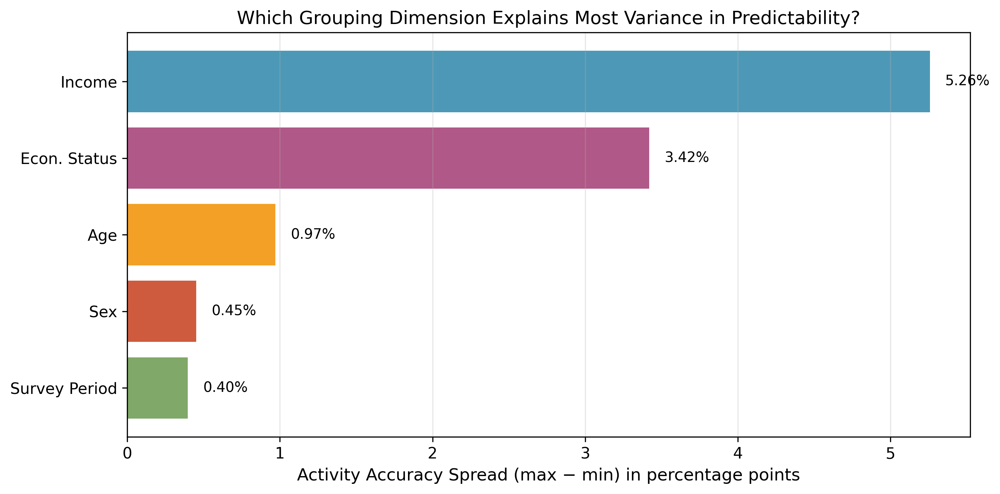
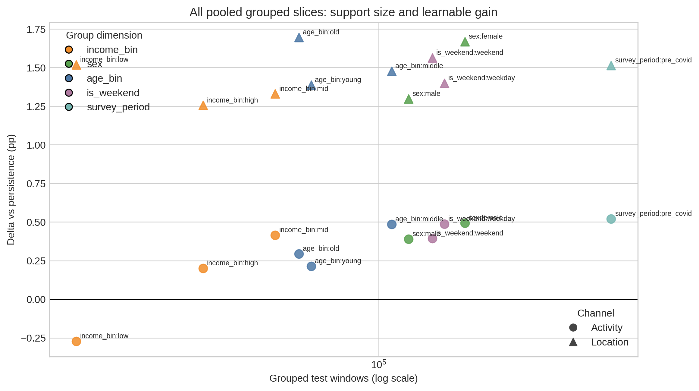

# LifeCast Project Overview

> 用途：导师优先入口 / 三阶段总成果总览  
> 项目：`Yucheng_Project`  
> 更新时间：2026-04-03

---

## 1) 一句话结论

LifeCast 现在已经不是“Phase 1 很强、后续阶段还在补”的状态，而是完成了一个真正闭环的三阶段研究程序：

- **Phase 1** 建立 UK 单国框架，证明日常生活高度可预测，而且这种可预测性具有清晰的社会分层结构；
- **Phase 2** 在 US 环境中验证这套机制能够迁移，同时把 `persistence`、`delta vs persistence`、`sample-size correction` 这些方法论问题彻底讲清楚；
- **Phase 3** 在 MTUS 七国 full runs 下完成外部效度闭环，证明 Transformer 相对 persistence 的小幅正增益不仅存在于总体，而且进入 grouped analysis。

如果要用一句适合导师快速把握项目状态的话来概括：

> 这个项目已经从“单国高分现象”推进成“跨国、跨阶段、跨证据层的正式研究叙事”：惯性始终强，但并非绝对 ceiling；模型在足够样本与正式 full runs 下仍能稳定保留小幅、真实、可复核的额外结构增益。

---

## 2) 三阶段主线总表

| 阶段 | 核心问题 | 当前证据规模 | 最关键结论 |
|---|---|---|---|
| Phase 1 | 在 UK 单国条件下，日常生活可预测性的机制是什么？ | `300+` 正式实验、四通道主报告、Phase 1 原始图资产 | 高准确率首先来自惯性，但社会分层会改变这种可预测性的强弱，尤其是 income / econstat |
| Phase 2 | 这套机制到 US 后还成立吗？为什么 quick 负 delta 不能被草率解释？ | `49` 个原始实验 JSON（`41` 完成结果 + `8` small-group 占位）+ `2` 个 tracker JSON + `10` 张正式图 | US 没有推翻主机制；真正重要的是：negative delta 需要 pooled 与 sample-size correction 才能被成熟解释 |
| Phase 3 | 当框架推进到 MTUS 七国 full runs 后，外部效度是否成立？ | `627` 个 MTUS 结果 JSON + `11` 个 cross-country CSV + `12` 张正式图 | Transformer 在 `7/7` 国家中保持正增益，且这种正值进入 grouped slices，外部效度成立 |

---

## 3) 项目规模快照

| 层级 | 当前规模 |
|---|---:|
| 三阶段总结果 JSON artifacts | `921` |
| 导师包报告集 | `6` 组 |
| 导师包文档 | `19` 份（MD/HTML/PDF + package index） |
| 最终精选图 | `39` 张 |
| 导师包原始图资产 | `41` 份 |
| 国家 / national settings | `9` |
| Phase 3 加权 test windows | `31,425,108` |

这组数字很重要，因为导师包里的最终图和主文是**正式汇报层**，而不是把整个 `results/` 目录原样倾倒出去。你现在看到的是一个经过收束后的“最终证据面”，其背后是已经完成的大规模结果树与 summary 层。

---

## 4) 现在为什么可以说“项目已完成”

这次完备性补全后，项目之所以可以被判断为真正完成，不是因为“字数更多”了，而是因为四层闭环已经补齐：

1. **报告层**：Phase 1 / 2 / 3 主报告都已进入正式叙事状态，不再存在“进行中口吻”或自我讨论式尾注。
2. **图像层**：Phase 2 已扩展为 `10` 图链，Phase 3 已扩展为 `12` 图链，关键缺口集中补在 uncertainty、support-size、country-level CI、grouped full-run distribution 上。
3. **summary 层**：Phase 3 的 `cross-country` summary 已经完整；Phase 2 现在也新增了统一的 `phase2_summary` 层，不再依赖散落目录做解释。
4. **交付层**：导师包、HTML/PDF、站内 reports hub、原始图资产与 zip bundle 已被组织成可直接阅读和转发的结构。

更重要的是，这次 closure audit 已经把主结论逐条对回到底层证据：Phase 2 的 pooled `activity` 分组切片现在是 **11 个里 10 个为正**、均值约 **+0.33pp**；Phase 3 的 Transformer 在 A1 主线上是 **7/7 国家为正**，在 `age_bin/sex` 的 grouped full-run 里则是 **35/35 个 country×group cells 为正**。因此，当前审计没有再发现“必须通过新补跑才能闭环”的关键证据缺口。剩下如果还要继续打磨，主要属于论文版式、caption 长度、附录拆分等表达层问题，而不是实验完成度问题。

---

## 5) 建议阅读顺序

1. 先看本文件的 PDF 或 HTML，快速把握三阶段主线与项目规模。
2. 再看 `PHASE1_COMPLETE_REPORT.pdf`，理解项目的理论起点与 UK 机制。
3. 接着看 `PHASE2_COMPLETE_REPORT.pdf`，理解为什么 Phase 2 不是“US 没跑出来”，而是把 `persistence` 与 `sample-size correction` 讲清楚的关键阶段。
4. 然后看 `PHASE3_COMPLETE_REPORT.pdf`，把跨国外部效度闭环读完整。
5. 若需要专门看图，再补 `PHASE2_VISUALIZATION_REPORT.pdf` 与 `PHASE3_VISUALIZATION_REPORT.pdf`。

---

## 6) 三张代表图

### 6.1 Phase 1：社会分层不是附属现象，而是主结论的一部分

Phase 1 的价值不只是“分数很高”，而是把 income / econstat / region 等分层维度组织成一个可以直接解释的社会科学结果面。

### 6.2 Phase 2：US 的关键不是立刻大幅超越，而是把 support-size pattern 讲清楚

这张图最能体现 Phase 2 的方法论价值：`activity` 的额外增益很小，但在足够样本下会系统性地靠近或越过零线；`location` 的正值则更稳、更整齐。

### 6.3 Phase 3：国家差异存在，但方向不分裂

这张图把 Phase 3 的最终判断压缩得最清楚：国家之间确实有强弱差异，但 Transformer 的 mean delta 在所有国家都仍位于零线上方，因此外部效度是成立的。

---

## 7) 包内内容说明

- 本目录中的 `.md` 是可编辑源文件。
- `.html` 是自包含的离线阅读版本。
- `.pdf` 是最适合直接发导师或打印批注的版本。
- `ORIGINAL_FIGURES/` 保存了三阶段原始图资产，便于单独抽图放进邮件、PPT 或批注稿。
- 同级 zip 包用于一次性发送完整交付物。

---

## 8) 最后一句给导师的判断

如果需要一句最稳妥、也最能体现项目成熟度的判断，可以直接写成：

> LifeCast has now reached a research-complete state across three phases: the UK framework, the US replication and methodology correction layer, and the MTUS seven-country external-validity layer have all been closed with aligned reports, figures, summaries, and supervisor-facing deliverables.
