# Phase 4 Plus Complete Report

> 作用：把 `Phase 4` 工程冻结之后新增的主线、图件、写作规则和 gate 约束，整理成一份可以直接给导师或合作者阅读的完整当前态报告。
> 默认 live 入口：`results/paper_ready_master_results/paper_ready_results_body.md`
> 当前 package：`ADVISOR_PACKAGE_PHASE4_PLUS_20260421`

---

## 1. Report Scope

这份报告不重写整个三阶段历史，而是专门回答四个问题：

1. `Phase 4` 之后到底新增了什么？
2. 当前哪些结果已经进入默认写作层？
3. 当前哪些边界必须明确保留？
4. 当前为什么不应该因为“还可以继续做”就重开 heavy experiments？

---

## 2. Phase 4 已经结束，项目进入了后续整合层

- `phase4_stage = frozen_complete`
- 默认冻结入口仍是 `results/phase4_master_status/summary.json`
- 当前开放工作代表的是 `next-stage / next-layer / delivery packaging`，不是 Phase 4 未完工。

这一步很重要，因为 meeting 后的若干 runbook 本来就是阶段性快照。当前真正应当优先服从的是 live summary、paper-ready master results 和 evidence gate，而不是旧文档中更保守的未完成表述。

---

## 3. Cross-country mainline 现在已经足以构成主结果桥

- UK frozen pooled reference: `UK_POOLED` / `markov_order1` / `accuracy=88.97%` / `delta=+0.00 pp`
- UK signal row: `UKDA-8128` / `logistic` / `accuracy=86.86%` / `delta=+0.04 pp`
- USA reference: `ATUS-2003-2024-15MIN` / `markov_order1` / `accuracy=85.67%` / `delta=+0.00 pp`
- MTUS current best row: `MTUS-ES` / `transformer` / `accuracy=85.31%` / `delta=+0.27 pp`
- MTUS wave-1 countries: `ES, IT, KR, NL, ZA`

当前这层证据已经足够支持 `a usable cross-country bridge`，但还不够支持 `a final pooled inference table`。

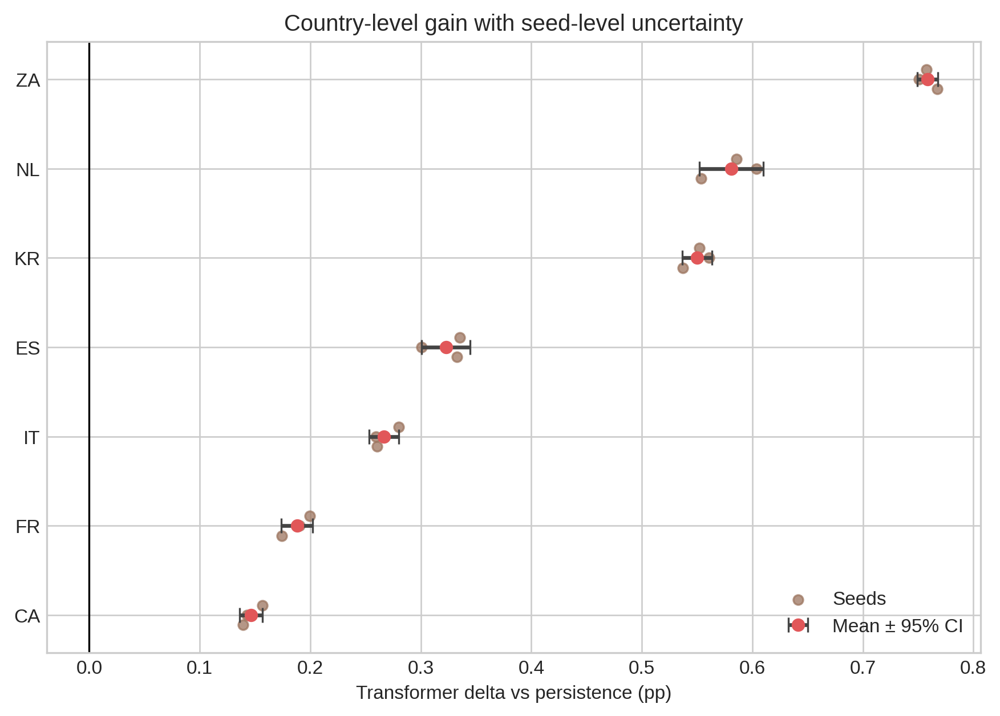

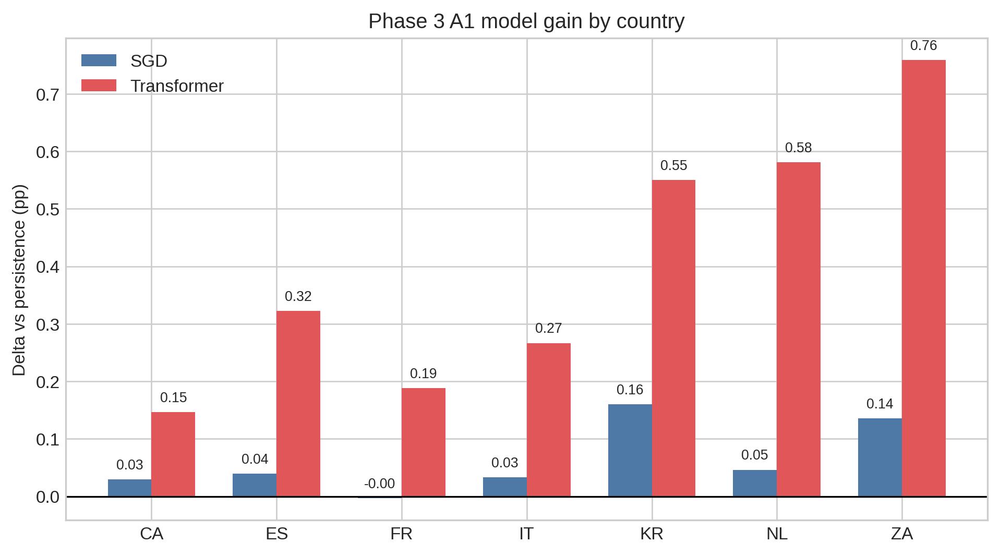

### 当前必须保留的 bridge 边界

1. UK / USA 是 stable references。
2. MTUS 仍然只能写成 `wave-1 partial evidence`。
3. UK stronger lane 只能作为 signal row，不能替代 UK frozen pooled anchor。
4. pooled 现在是 writable bridge，不是 final pooled baseline table。

---

## 4. 机制主线已经成熟，但必须继续写成 stay-versus-transition 语言

当前最重要的解释不是“总 accuracy 高”，而是：

- W=1 transition accuracy = `0.00%`
- W=6 transition accuracy = `0.00%`
- W=12 transition accuracy = `0.00%`
- Contextual AP = `18.75%`
- Hazard AP = `19.57%`

> strong aggregate predictability still reflects routine persistence more than solved transition modeling.

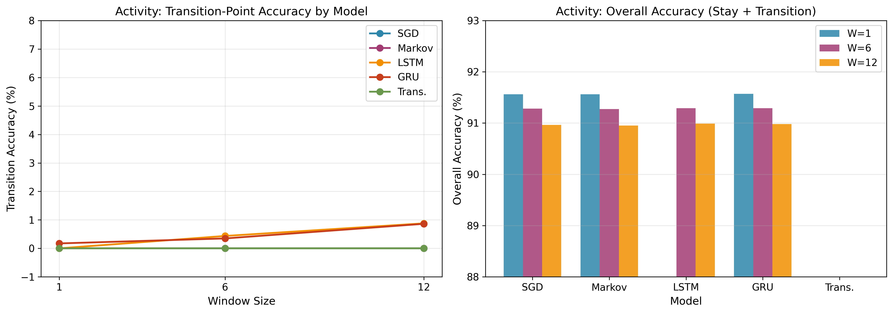

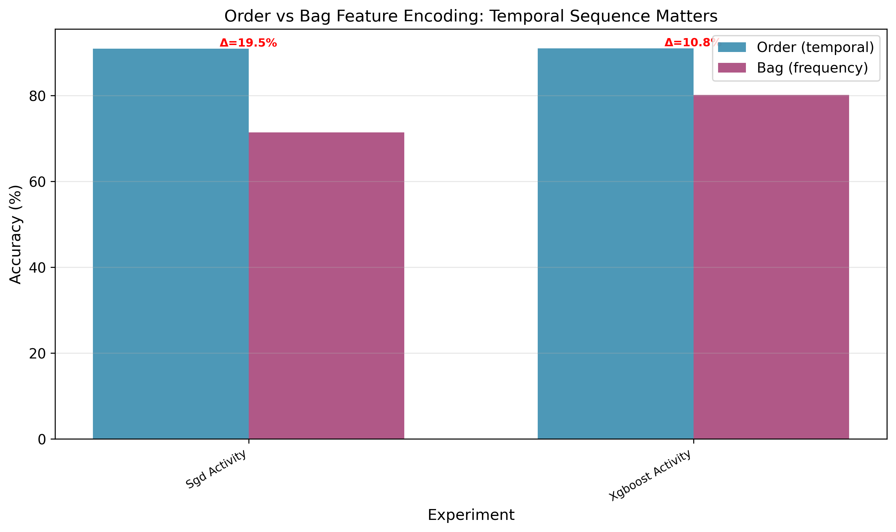

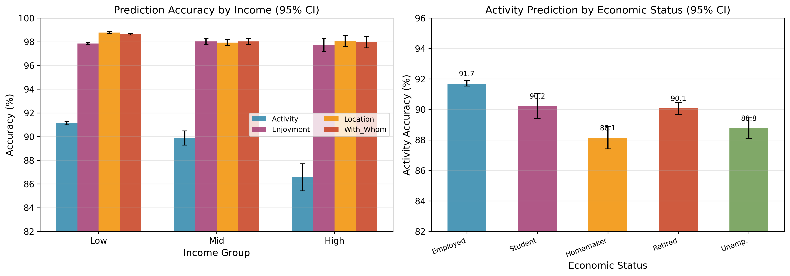

---

## 5. Group B 已经进入可写层，但写法必须带边界和层级

- 当前 Group B 总状态：`groupb_master_with_boundaries_ready`
- 写作顺序固定为 `employment -> gender -> income`，age 只保留 supporting context。
- employment: `MTUS-NL` / `employed` / `accuracy=84.38%` / `delta=+0.23 pp`
- gender: `ATUS-2003-2024-15MIN` / `female` / `accuracy=83.02%` / `delta=+0.49 pp`
- income: `ATUS-2003-2024-15MIN` / `known` / `accuracy=83.10%` / `delta=+0.08 pp`
- age: `MTUS-ZA` / `young` / `accuracy=90.07%` / `delta=+0.33 pp`

> ZA econstat_broad=employed remains a structural coverage boundary because it skipped under both quick and full settings.

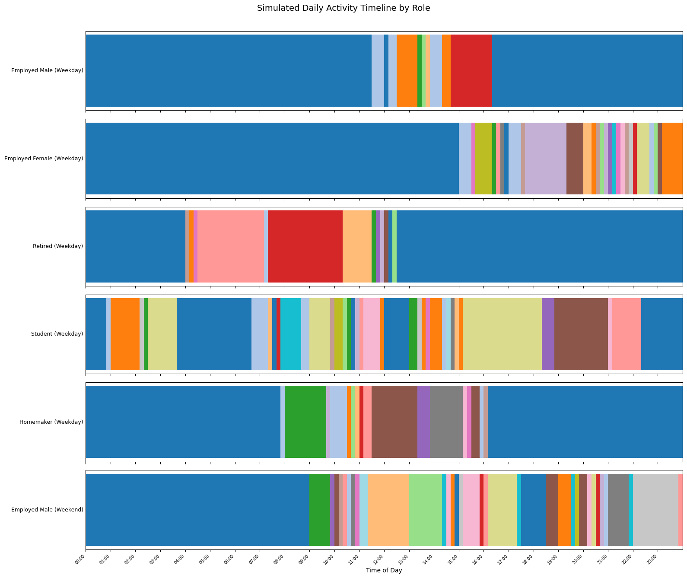

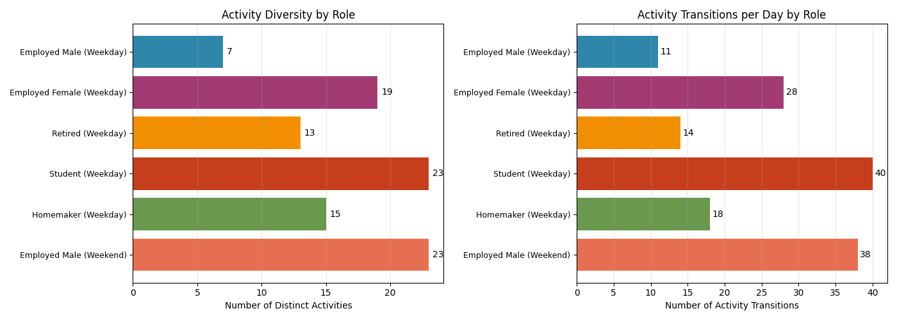

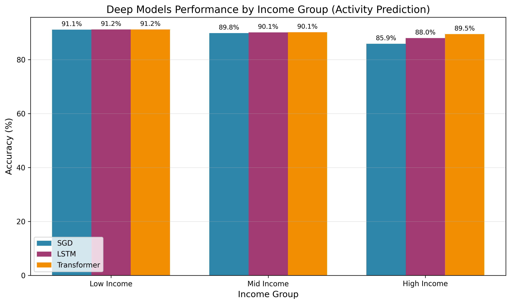

当前正确用法是：Figure 10 负责当前 bootstrap-backed stratification anchor，Figure 13 / Figure 14 负责 communication layer，supplementary income figure 负责说明复杂模型 lift 只在更难 subgroup 上局部出现。

---

## 6. pooled 与 MTUS 现在已经是 comparison-ready bridge，而不是 prose 空白

- pooled status: `bridge_ready_with_subgroup_sync`
- MTUS status: `a1_b1_partial_results_available`
- MTUS writing status: `wave1_partial_integrated_into_master_sync`
- 当前安全句式是 `comparison-ready bridge, not final pooled table`。

这层不是缺 prose，而是 evidence tier 还没被允许升格成 final pooled inference。所以 package 需要把已有桥接证据完整展示出来，而不是用“缺一张终表”来掩盖已有成果。

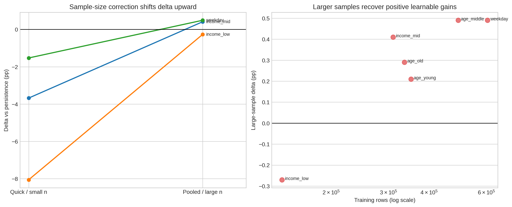

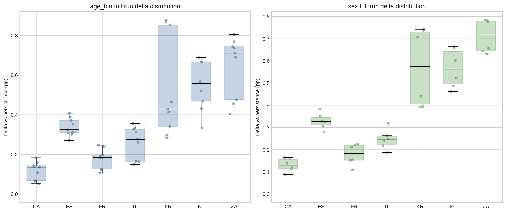

---

## 7. next-layer 已经是结果层，不再是伪待办

- 当前 next-layer 总状态：`grounded_extension_ready`
- trigger descriptive layer 已经明确告诉我们：transition 还没被解决。
- contextual explanatory modeling 与 hazard framing 已经提供 descriptive support。
- expanding-window 是 `7/7 negative` 的 cross-country boundary。
- typical-day 是 `+0.05 pp` 的近乎中性 robustness 结果。

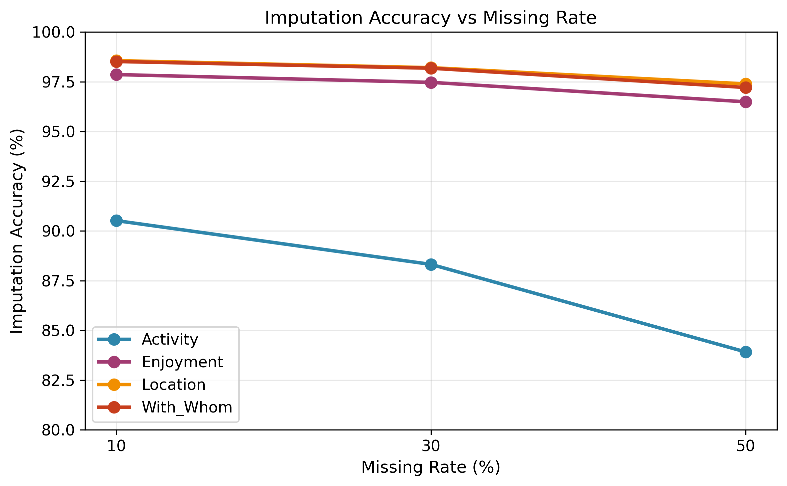

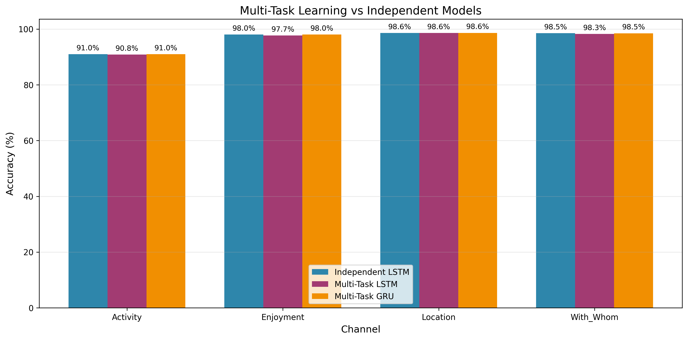

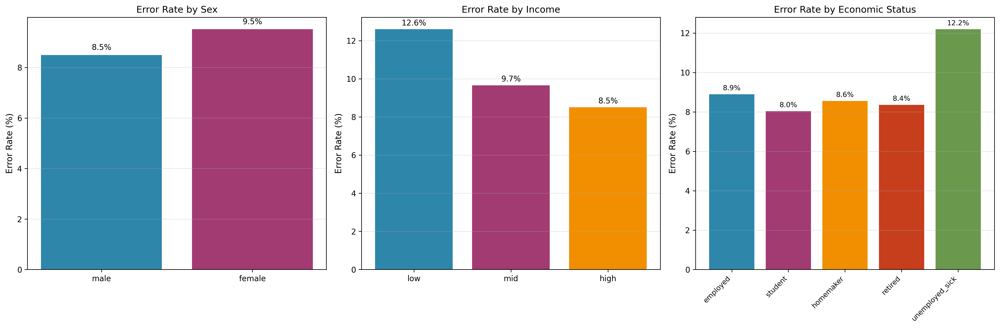

---

## 8. 当前 package 的图件系统已经足够丰富，而且是分层组织的

- package 当前一共显式收纳 `29` 张 canonical figures；
- 其中 `6` 张是本次生成的 current-delivery figures；
- `3` 张是当前主叙事反复引用的 anchor figures；
- `14` 张来自当前项目图件资产；
- `6` 张来自历史 archive support figures；
- 所有图都有 package-local canonical path，同时保留 `ORIGINAL_FIGURES/` 镜像供邮件、批注和 PPT 直接抽图。

下面这些历史图件不再承担当前主故事，但它们仍然属于必须被保留的图像系统，因为它们解释了早期发现来自哪里、为什么后来叙事会发生迁移。

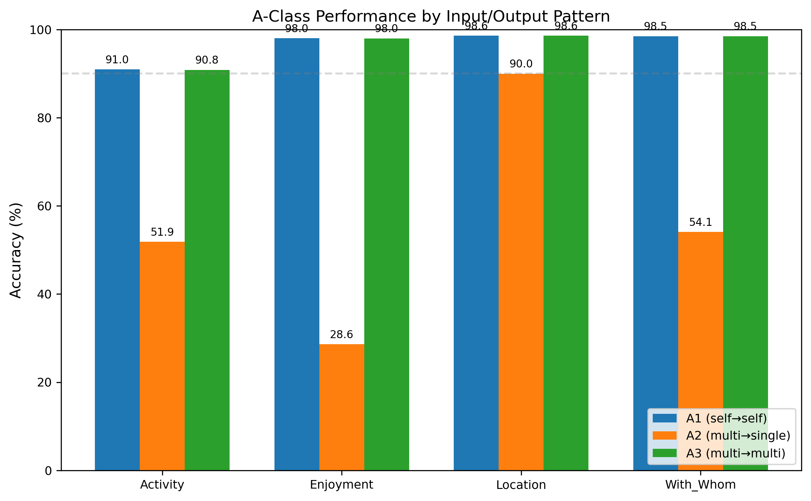

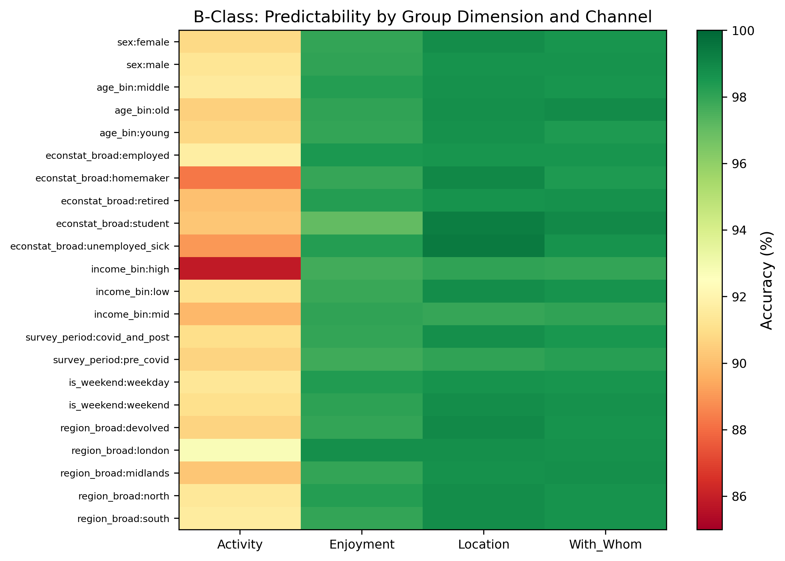

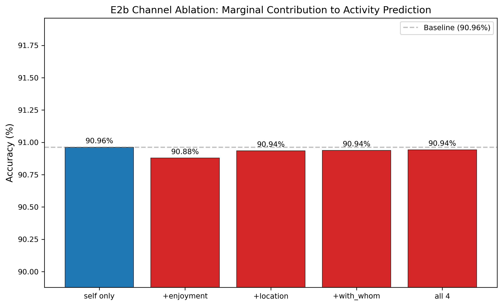

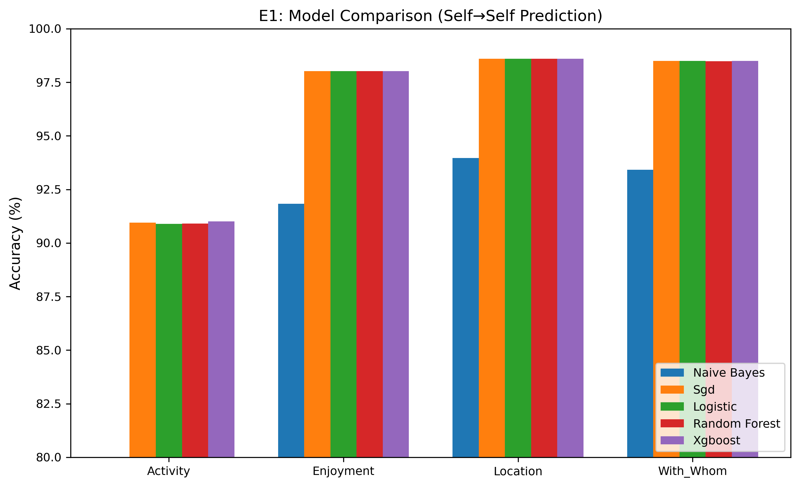

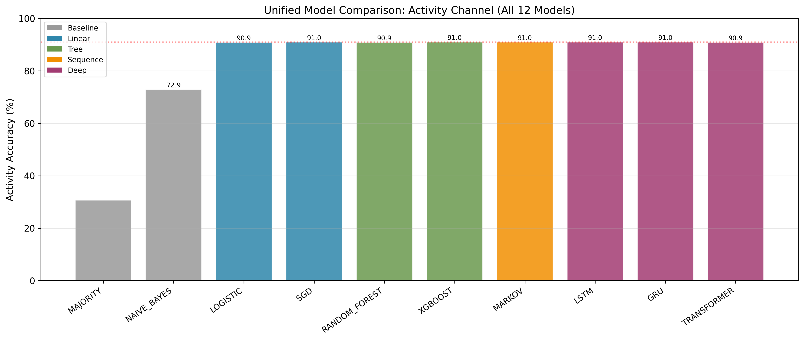

---

## 9. 为什么当前不该重开 heavy experiments

- overall_status = `default_delivery_ready_heavy_experiments_not_required`
- recommended_action = `freeze_default_delivery_and_defer_heavy_experiments_until_stronger_claim_is_required`
- default delivery gate = `pass`
- final pooled table gate = `hold`
- low-cost sync gate = `pass`
- heavy experiment gate = `hold`

当前最关键的判断规则是：默认交付已经 ready、cheap sync gap 已关闭，而 heavy experiments 只有在需要更强 claim 时才应该重新打开。

---

## 10. 当前最稳的 safe claims

- The project now has a usable cross-country activity bridge across UK, USA, and 5 MTUS wave-1 countries (ES, IT, KR, NL, ZA), but MTUS must still be written as wave-1 partial evidence.
- The dominant project-level pattern remains persistence/stay dominance rather than strong transition learning: W=1 transition=0.00%, W=6 transition=0.00%, W=12 transition=0.00%.
- Pooled is now comparison-ready with subgroup synchronization, but it still has to be written as stable UK/USA references plus MTUS partial evidence rather than as a final pooled baseline table.
- Group B should still be written in the order employment -> gender -> income, and ZA econstat_broad=employed remains a structural coverage boundary because it skipped under both quick and full settings.
- Contextual explanatory and hazard layers now support trigger interpretation descriptively: contextual AP=18.75% against a 7.24% base rate; hazard AP=19.57% at a 6.89% hazard rate.
- Longer-history and typical-day are now boundary layers rather than open gaps: expanding-window is negative in 7 of 7 rows, and typical-day changes UK accuracy by +0.05 pp.

## 11. 当前必须避免的 claims

- Do not rewrite the project as a final pooled inference table that already treats MTUS wave-1 as fully stabilized evidence.
- Do not present high overall accuracy as solved transition modeling; the main pattern is still routine persistence.
- Do not write Group B in an accuracy-first order or hide the ZA employed structural boundary.
- Do not turn contextual explanatory or hazard outputs into causal trigger claims.
- Do not reopen expanding-window or typical-day as pseudo-missing work unless a larger explicit rerun is required.

## 12. 推荐图件顺序

- `figure6_transition_analysis.png`: Primary mechanism-first anchor: high overall accuracy, perfect stay accuracy, and zero transition accuracy.
- `figure10_dimension_importance.png`: Primary Group B / stratification anchor, with the caption explicitly limited to the current bootstrap-backed subset.
- `figure8_input_info_effect.png`: Supporting boundary figure showing that longer histories and more channels do not materially improve prediction.

## 13. 当前交付层建议

1. 默认先用 `PHASE4_PLUS_PROJECT_OVERVIEW.pdf` 让导师快速把握状态变化。
2. 若要看完整逻辑，再读本文件对应的 PDF。
3. 若要系统看图件与索引，再读 `PHASE4_PLUS_VISUALIZATION_ATLAS.pdf`。
4. 若要抽图进邮件、PPT 或批注文档，可直接从 `ORIGINAL_FIGURES/` 取图。
