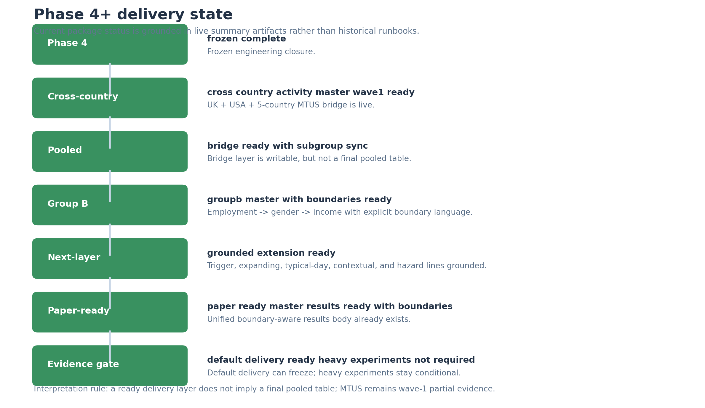
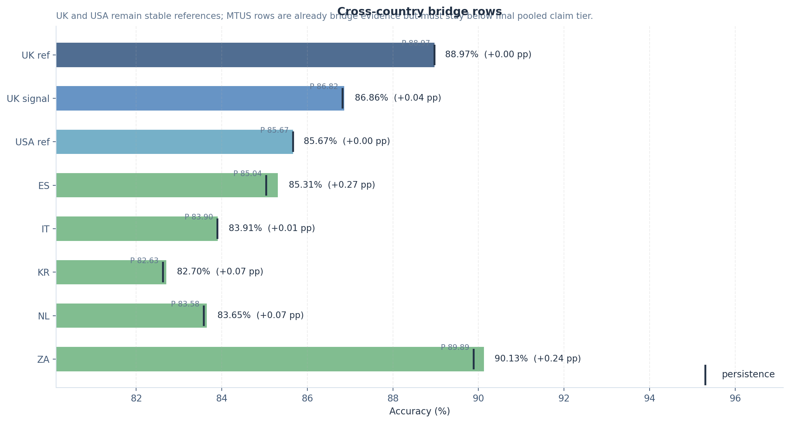
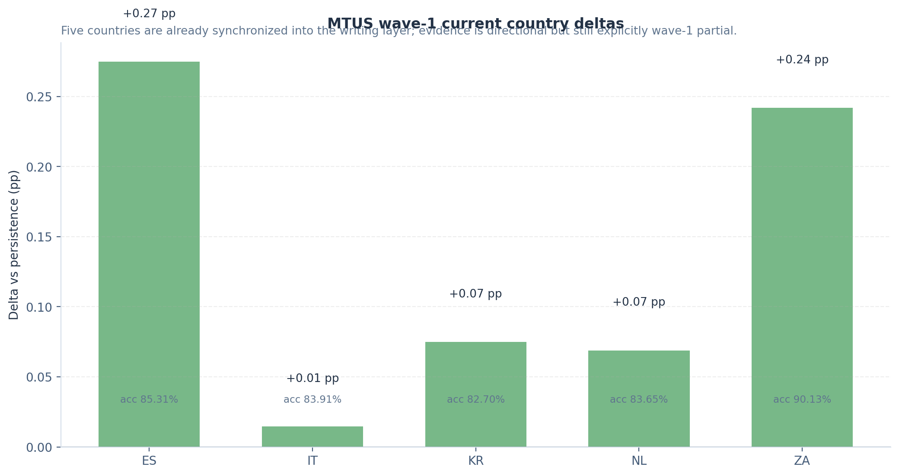
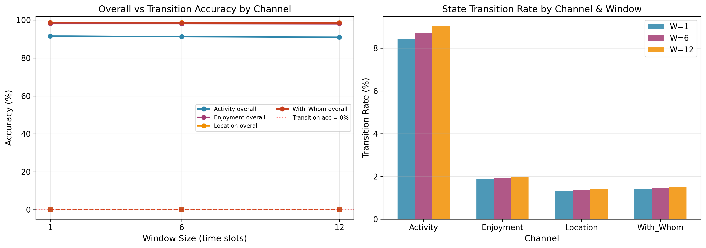
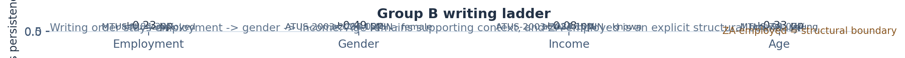
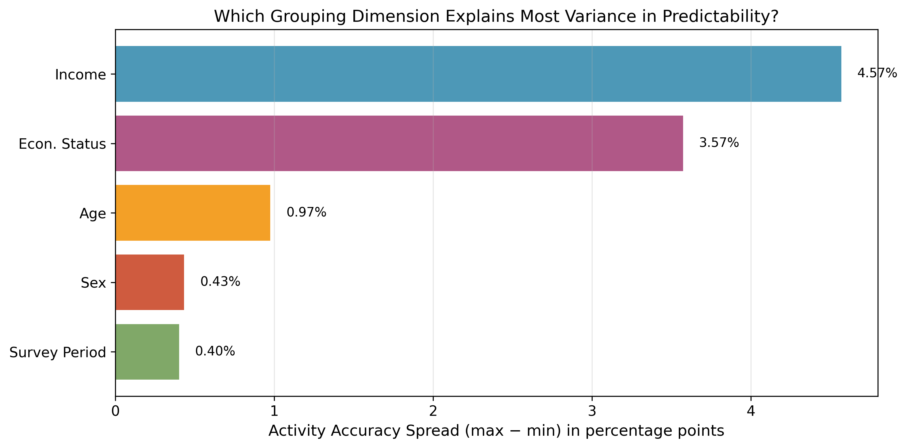
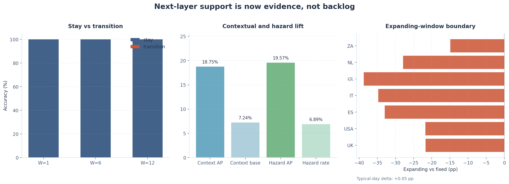
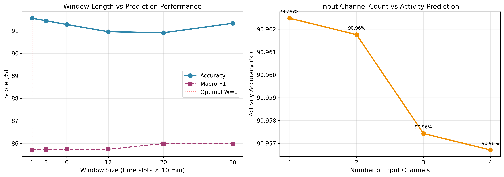
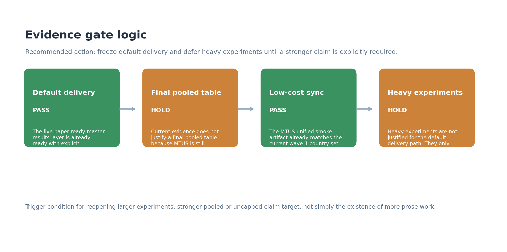

# Phase 4 Plus Complete Report

        > 作用：把 `Phase 4` 工程冻结之后新增的主线、图件、写作规则和 gate 约束，整理成一份可以直接给导师或合作者阅读的完整当前态报告。  
        > 默认 live 入口：`results/paper_ready_master_results/paper_ready_results_body.md`  
        > 当前 package：`ADVISOR_PACKAGE_PHASE4_PLUS_20260421`

        ---

        ## 1. Report Scope

        这份报告不重写整个三阶段历史，而是专门回答四个问题：

        1. `Phase 4` 之后到底新增了什么？
        2. 当前哪些结果已经进入默认写作层？
        3. 当前哪些边界必须明确保留？
        4. 当前为什么不应该因为“还可以继续做”就重开 heavy experiments？

        ---

        ## 2. Phase 4 到底完成了什么

        狭义 `Phase 4` 的工程结论已经固定为：

        - `phase4_stage = frozen_complete`
        - 默认冻结入口仍是 `results/phase4_master_status/summary.json`

        这个层面现在的作用已经很明确：

        - 作为 UK / USA rebuild 的冻结参考；
        - 作为后续 `next-stage` 与 `next-layer` 的工程起点；
        - 作为“不能再把 next-stage 误写成 Phase 4 没做完”的边界。

        也就是说，当前项目的开放工作并不表示 Phase 4 没完成，而是说明项目已经进入了 **Phase 4 之后的结果整合层**。

        

        ---

        ## 3. Cross-country mainline 已经到了哪一层

        当前 cross-country bridge 的核心读法来自 `results/next_stage_cross_country_activity_master/summary.json` 与 `results/paper_ready_master_results/summary.json`：

        - UK frozen pooled reference: `UK_POOLED` / `markov_order1` / `accuracy=88.97%` / `delta=+0.00 pp`
        - UK signal row: `UKDA-8128` / `logistic` / `accuracy=86.86%` / `delta=+0.04 pp`
        - USA reference: `ATUS-2003-2024-15MIN` / `markov_order1` / `accuracy=85.67%` / `delta=+0.00 pp`
        - MTUS current best row: `MTUS-ES` / `transformer` / `accuracy=85.31%` / `delta=+0.27 pp`
        - MTUS wave-1 countries: `ES, IT, KR, NL, ZA`

        当前这层证据已经足够支持：

        > a usable cross-country bridge

        但还不够支持：

        > a final pooled inference table

        

        

        ### 当前必须保留的 bridge 边界

        1. UK / USA 是 stable references
        2. MTUS 是 `wave-1 partial evidence`
        3. UK stronger lane 只能作为 signal row，不能替代 UK frozen pooled anchor
        4. pooled 现在是 writable bridge，不是 final pooled baseline table

        ---

        ## 4. 当前真正成熟的解释语言是什么

        当前最重要的解释并不是“总 accuracy 高”，而是：

        - `stay / persistence` 很强；
        - `transition` 仍明显更难；
        - 当前模型对变化点的描述仍应保持边界感。

        这也是为什么 `Figure 6` 仍然是当前最强的解释锚点：

        

        根据当前 next-layer summary：

        - W=1 transition accuracy = `0.00%`
        - W=6 transition accuracy = `0.00%`
        - W=12 transition accuracy = `0.00%`
        - Contextual AP = `18.75%`
        - Hazard AP = `19.57%`

        因此当前最稳妥的文字应保持为：

        > strong aggregate predictability still reflects routine persistence more than solved transition modeling.

        ---

        ## 5. Group B 现在应该怎么写

        当前 Group B 已进入 `groupb_master_with_boundaries_ready`，写作顺序固定为：

        1. employment
        2. gender
        3. income

        当前最关键的四个 axis 摘要如下：

        - employment: `MTUS-NL` / `employed` / `accuracy=84.38%` / `delta=+0.23 pp`
        - gender: `ATUS-2003-2024-15MIN` / `female` / `accuracy=83.02%` / `delta=+0.49 pp`
        - income: `ATUS-2003-2024-15MIN` / `known` / `accuracy=83.10%` / `delta=+0.08 pp`
        - age: `MTUS-ZA` / `young` / `accuracy=90.07%` / `delta=+0.33 pp`

        当前 Group B 最重要的边界句也已经固定：

        > ZA econstat_broad=employed remains a structural coverage boundary because it skipped under both quick and full settings.

        

        `Figure 10` 仍是当前最好的社会分层锚点，但它必须带上明确 caption 边界：

        

        当前正确用法是：

        - 用它转入 social stratification；
        - 明确说明它服务的是当前 bootstrap-backed subset；
        - 不把它误写成完整 seven-dimension ranking。

        ---

        ## 6. Pooled 和 MTUS 现在如何安全整合

        当前 pooled 读法已经比“还没 prose”成熟得多：

        - pooled status: `bridge_ready_with_subgroup_sync`
        - MTUS status: `a1_b1_partial_results_available`
        - MTUS writing status: `wave1_partial_integrated_into_master_sync`

        这意味着：

        - pooled 已经进入 bridge-with-subgroup-sync 层；
        - MTUS wave-1 已经接入写作层；
        - 但 pooled evidence tier 还没有升格成 final pooled inference。

        换句话说，当前最安全的 pooled 句式是：

        > comparison-ready bridge, not final pooled table

        而不是：

        > finished pooled baseline

        ---

        ## 7. next-layer 现在不是待办，而是结果层

        当前 next-layer 已整体进入 `grounded_extension_ready`。这层最重要的不是“还有没有想做的 extension”，而是：

        - trigger descriptive layer 已经明确告诉我们：transition 还没被解决；
        - contextual explanatory modeling 与 hazard framing 已经给出 descriptive support；
        - expanding-window 现在是 `7/7 negative` 的 cross-country boundary；
        - typical-day 现在是 `+0.05 pp` 的近乎中性 robustness 结果。

        

        `Figure 8` 在这层的作用也已经更明确了：

        

        它不再只是旧实验图，而是当前 supporting boundary figure：

        - 更长 history 不会自动带来更好结果；
        - 更多 channels 也不等于显著性能改善；
        - 所以当前 extension 层应更多服务边界表达，而不是重开伪主线。

        ---

        ## 8. 为什么当前不该重开 heavy experiments

        当前 evidence gate 的正式结论是：

        - overall_status = `default_delivery_ready_heavy_experiments_not_required`
        - recommended_action = `freeze_default_delivery_and_defer_heavy_experiments_until_stronger_claim_is_required`

        四个 gate 的当前结果是：

        - default delivery gate = `pass`
        - final pooled table gate = `hold`
        - low-cost sync gate = `pass`
        - heavy experiment gate = `hold`

        

        当前最关键的判断规则是：

        1. 默认交付已经 ready；
        2. cheap sync gap 已关闭；
        3. heavy experiments 只有在需要更强 claim 时才应该重新打开。

        所以，现在继续工作的正确方向不是“为了继续而继续”，而是：

        - package 化；
        - 网站同步；
        - communication 一致化；
        - 只在更强 claim 被明确提出时再开更高证据层实验。

        ---

        ## 9. 当前最稳的 safe claims

        - The project now has a usable cross-country activity bridge across UK, USA, and 5 MTUS wave-1 countries (ES, IT, KR, NL, ZA), but MTUS must still be written as wave-1 partial evidence.
- The dominant project-level pattern remains persistence/stay dominance rather than strong transition learning: W=1 transition=0.00%, W=6 transition=0.00%, W=12 transition=0.00%.
- Pooled is now comparison-ready with subgroup synchronization, but it still has to be written as stable UK/USA references plus MTUS partial evidence rather than as a final pooled baseline table.
- Group B should still be written in the order employment -> gender -> income, and ZA econstat_broad=employed remains a structural coverage boundary because it skipped under both quick and full settings.
- Contextual explanatory and hazard layers now support trigger interpretation descriptively: contextual AP=18.75% against a 7.24% base rate; hazard AP=19.57% at a 6.89% hazard rate.
- Longer-history and typical-day are now boundary layers rather than open gaps: expanding-window is negative in 7 of 7 rows, and typical-day changes UK accuracy by +0.05 pp.

        ## 10. 当前必须避免的 claims

        - Do not rewrite the project as a final pooled inference table that already treats MTUS wave-1 as fully stabilized evidence.
- Do not present high overall accuracy as solved transition modeling; the main pattern is still routine persistence.
- Do not write Group B in an accuracy-first order or hide the ZA employed structural boundary.
- Do not turn contextual explanatory or hazard outputs into causal trigger claims.
- Do not reopen expanding-window or typical-day as pseudo-missing work unless a larger explicit rerun is required.

        ---

        ## 11. 推荐图件顺序

        - `figure6_transition_analysis.png`: Primary mechanism-first anchor: high overall accuracy, perfect stay accuracy, and zero transition accuracy.
- `figure10_dimension_importance.png`: Primary Group B / stratification anchor, with the caption explicitly limited to the current bootstrap-backed subset.
- `figure8_input_info_effect.png`: Supporting boundary figure showing that longer histories and more channels do not materially improve prediction.

        ---

        ## 12. 当前交付层建议

        1. 默认先用 `PHASE4_PLUS_PROJECT_OVERVIEW.pdf` 让导师快速把握状态变化。
        2. 若要看完整逻辑，再读本文件对应的 PDF。
        3. 若要快速看图件与索引，再读 `PHASE4_PLUS_VISUALIZATION_ATLAS.pdf`。
        4. 若要抽图进邮件、PPT 或批注文档，可直接从 `ORIGINAL_FIGURES/` 取图。
