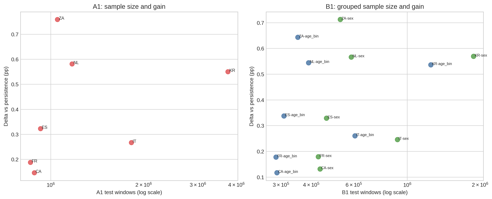

# Phase 4 Plus Visualization Atlas

> 用途：对当前 package 中所有 figure 的用途、路径和引用方式做一份统一说明。
> 原则：本 atlas 既回答“哪些图被用了”，也回答“每张图在当前论证中负责什么”。

---

## 1. 为什么当前 package 需要单独的图件 atlas

当前 `Phase 4 + next-stage + next-layer` 的叙事既依赖旧的 anchor figures，也依赖这次新生成的状态/bridge/gate 图；同时，meeting 里已经明确要求主图、补充图、历史图、archive support figure 分层管理。因此，如果只给 PDF，而不给单独 atlas，后来的人很容易知道“图存在”，但不知道：

- 哪张图服务 mechanism-first；
- 哪张图服务 Group B；
- 哪张图只是 boundary/support；
- 哪张图是这次 package 新增，而不是旧项目遗留；
- 哪张图来自当前项目树，哪张图来自 archive support tree。

---

## 2. 当前 figure inventory 摘要

- current-delivery generated figures: `6`
- anchor figures reused in current story: `3`
- current project support figures: `14`
- archive support figures: `6`
- canonical figure total in this package: `29`

### 2.1 Current generated figures

- `F1` | `results/phase4plus_figures/phase4plus_fig1_delivery_status_matrix.png` | Top-level state ladder from frozen Phase 4 to evidence-gated delivery.
- `F2` | `results/phase4plus_figures/phase4plus_fig2_cross_country_bridge.png` | Accuracy and delta profile for UK, USA, and MTUS wave-1 bridge rows.
- `F3` | `results/phase4plus_figures/phase4plus_fig3_mtus_wave1_country_delta.png` | Five-country wave-1 delta profile for current MTUS bridge evidence.
- `F4` | `results/phase4plus_figures/phase4plus_fig4_groupb_axes.png` | Employment, gender, income, and age status with structural-boundary annotation.
- `F5` | `results/phase4plus_figures/phase4plus_fig5_extension_support.png` | Trigger difficulty, contextual/hazard lift, and expanding-window negativity.
- `F6` | `results/phase4plus_figures/phase4plus_fig6_evidence_gate.png` | Default-delivery pass/hold structure and stronger-claim trigger rule.

### 2.2 Current anchor figures

- `ANCHOR-6` | `results/anchor_figures/figure6_transition_analysis.png` | Primary mechanism-first anchor for stay versus transition asymmetry.
- `ANCHOR-8` | `results/anchor_figures/figure8_input_info_effect.png` | Anchor figure for the claim that more history or channels do not materially improve prediction.
- `ANCHOR-10` | `results/anchor_figures/figure10_dimension_importance.png` | Primary social-stratification figure, but only under explicit caption boundaries.

### 2.3 Current project support figures

- `FIGURE1` | `results/project_figures/figure1_a_class_performance.png` | Historical stage overview for cross-channel asymmetry. Keep as background, not current mainline.
- `FIGURE2` | `results/project_figures/figure2_b_class_heatmap.png` | Grouped heatmap context for older subgroup evidence.
- `FIGURE3` | `results/project_figures/figure3_e2b_waterfall.png` | Historical channel-to-channel asymmetry support figure.
- `FIGURE4` | `results/project_figures/figure4_e1_model_comparison.png` | Historical accuracy-first comparison. Preserve as archive evidence only.
- `FIGURE5` | `results/project_figures/figure5_bootstrap_ci.png` | Bootstrap uncertainty support for between-group spread estimates.
- `FIGURE7` | `results/project_figures/figure7_imputation_robustness.png` | Supplementary robustness figure for missingness handling.
- `FIGURE9` | `results/project_figures/figure9_unified_model_comparison.png` | Historical unified comparison figure retained as background.
- `FIGURE11` | `results/project_figures/figure11_deep_transition.png` | Current mainline support figure for transition difficulty across model families.
- `FIGURE12` | `results/project_figures/figure12_order_vs_bag.png` | Current mechanism-support figure showing sequence order dominance.
- `FIGURE13` | `results/project_figures/figure13_role_timelines.png` | Interpretive timeline figure for role-pattern communication.
- `FIGURE14` | `results/project_figures/figure14_role_comparison.png` | Interpretive comparison figure for role-pattern communication.
- `SUPP1` | `results/project_figures/supplementary_fig1_deep_models_by_income.png` | Supplementary figure for high-income complexity and deep-model lift.
- `SUPP2` | `results/project_figures/supplementary_fig2_multitask_comparison.png` | Supplementary architecture-comparison figure.
- `SUPP3` | `results/project_figures/supplementary_fig3_error_rate_by_group.png` | Supplementary group-level error distribution figure.

### 2.4 Archive support figures

- `P2-F8` | `results/archive_support_figures/phase2_fig8_us_sample_size_delta_shift.png` | Archive support figure showing why quick negatives should not be over-read without pooled support.
- `P2-F10` | `results/archive_support_figures/phase2_fig10_us_pooled_support_vs_delta.png` | Archive support figure for pooled support-width and activity/location delta interpretation.
- `P3-F1` | `results/archive_support_figures/phase3_fig1_a1_delta_by_country.png` | Archive support figure for MTUS country-level external-validity variation.
- `P3-F10` | `results/archive_support_figures/phase3_fig10_sample_size_vs_delta.png` | Archive support figure for sample-size sensitivity in external-validity runs.
- `P3-F11` | `results/archive_support_figures/phase3_fig11_a1_country_ci_forest.png` | Archive support figure for country-level uncertainty without sign reversal.
- `P3-F12` | `results/archive_support_figures/phase3_fig12_b1_distribution_boxplots.png` | Archive support figure for grouped full-run distributions across countries.

---

## 3. 图件逐张说明

### 3.1 Current generated figures

#### 1. Phase 4+ delivery status matrix

- canonical_path: `results/phase4plus_figures/phase4plus_fig1_delivery_status_matrix.png`
- original_path: `ORIGINAL_FIGURES/PHASE4PLUS_results_figures/phase4plus_fig1_delivery_status_matrix.png`
- source: `live summary jsons`
- package role: Top-level state ladder from frozen Phase 4 to evidence-gated delivery.

#### 2. Cross-country bridge rows

- canonical_path: `results/phase4plus_figures/phase4plus_fig2_cross_country_bridge.png`
- original_path: `ORIGINAL_FIGURES/PHASE4PLUS_results_figures/phase4plus_fig2_cross_country_bridge.png`
- source: `results/next_stage_cross_country_activity_master/summary.json`
- package role: Accuracy and delta profile for UK, USA, and MTUS wave-1 bridge rows.

#### 3. MTUS wave-1 country deltas

- canonical_path: `results/phase4plus_figures/phase4plus_fig3_mtus_wave1_country_delta.png`
- original_path: `ORIGINAL_FIGURES/PHASE4PLUS_results_figures/phase4plus_fig3_mtus_wave1_country_delta.png`
- source: `results/next_stage_cross_country_activity_master/summary.json`
- package role: Five-country wave-1 delta profile for current MTUS bridge evidence.

#### 4. Group B axis ladder

- canonical_path: `results/phase4plus_figures/phase4plus_fig4_groupb_axes.png`
- original_path: `ORIGINAL_FIGURES/PHASE4PLUS_results_figures/phase4plus_fig4_groupb_axes.png`
- source: `results/next_stage_groupb_master/summary.json`
- package role: Employment, gender, income, and age status with structural-boundary annotation.

#### 5. Next-layer support and boundary evidence

- canonical_path: `results/phase4plus_figures/phase4plus_fig5_extension_support.png`
- original_path: `ORIGINAL_FIGURES/PHASE4PLUS_results_figures/phase4plus_fig5_extension_support.png`
- source: `results/next_layer_extension_summary/summary.json`
- package role: Trigger difficulty, contextual/hazard lift, and expanding-window negativity.

#### 6. Evidence gate decision

- canonical_path: `results/phase4plus_figures/phase4plus_fig6_evidence_gate.png`
- original_path: `ORIGINAL_FIGURES/PHASE4PLUS_results_figures/phase4plus_fig6_evidence_gate.png`
- source: `results/evidence_gate_decision/summary.json`
- package role: Default-delivery pass/hold structure and stronger-claim trigger rule.

### 3.2 Current anchor figures

#### 7. Figure 6 transition analysis

- canonical_path: `results/anchor_figures/figure6_transition_analysis.png`
- original_path: `ORIGINAL_FIGURES/ANCHOR_results_figures/figure6_transition_analysis.png`
- source: `results/figures/figure6_transition_analysis.png`
- package role: Primary mechanism-first anchor for stay versus transition asymmetry.

#### 8. Figure 8 input-information effect

- canonical_path: `results/anchor_figures/figure8_input_info_effect.png`
- original_path: `ORIGINAL_FIGURES/ANCHOR_results_figures/figure8_input_info_effect.png`
- source: `results/figures/figure8_input_info_effect.png`
- package role: Anchor figure for the claim that more history or channels do not materially improve prediction.

#### 9. Figure 10 dimension importance

- canonical_path: `results/anchor_figures/figure10_dimension_importance.png`
- original_path: `ORIGINAL_FIGURES/ANCHOR_results_figures/figure10_dimension_importance.png`
- source: `results/figures/figure10_dimension_importance.png`
- package role: Primary social-stratification figure, but only under explicit caption boundaries.

### 3.3 Current project support figures

#### 10. Figure 1 A-class performance

- canonical_path: `results/project_figures/figure1_a_class_performance.png`
- original_path: `ORIGINAL_FIGURES/PROJECT_results_figures/figure1_a_class_performance.png`
- source: `results/figures/figure1_a_class_performance.png`
- package role: Historical stage overview for cross-channel asymmetry. Keep as background, not current mainline.

#### 11. Figure 2 B-class heatmap

- canonical_path: `results/project_figures/figure2_b_class_heatmap.png`
- original_path: `ORIGINAL_FIGURES/PROJECT_results_figures/figure2_b_class_heatmap.png`
- source: `results/figures/figure2_b_class_heatmap.png`
- package role: Grouped heatmap context for older subgroup evidence.

#### 12. Figure 3 E2B waterfall

- canonical_path: `results/project_figures/figure3_e2b_waterfall.png`
- original_path: `ORIGINAL_FIGURES/PROJECT_results_figures/figure3_e2b_waterfall.png`
- source: `results/figures/figure3_e2b_waterfall.png`
- package role: Historical channel-to-channel asymmetry support figure.

#### 13. Figure 4 E1 model comparison

- canonical_path: `results/project_figures/figure4_e1_model_comparison.png`
- original_path: `ORIGINAL_FIGURES/PROJECT_results_figures/figure4_e1_model_comparison.png`
- source: `results/figures/figure4_e1_model_comparison.png`
- package role: Historical accuracy-first comparison. Preserve as archive evidence only.

#### 14. Figure 5 bootstrap confidence intervals

- canonical_path: `results/project_figures/figure5_bootstrap_ci.png`
- original_path: `ORIGINAL_FIGURES/PROJECT_results_figures/figure5_bootstrap_ci.png`
- source: `results/figures/figure5_bootstrap_ci.png`
- package role: Bootstrap uncertainty support for between-group spread estimates.

#### 15. Figure 7 imputation robustness

- canonical_path: `results/project_figures/figure7_imputation_robustness.png`
- original_path: `ORIGINAL_FIGURES/PROJECT_results_figures/figure7_imputation_robustness.png`
- source: `results/figures/figure7_imputation_robustness.png`
- package role: Supplementary robustness figure for missingness handling.

#### 16. Figure 9 unified model comparison

- canonical_path: `results/project_figures/figure9_unified_model_comparison.png`
- original_path: `ORIGINAL_FIGURES/PROJECT_results_figures/figure9_unified_model_comparison.png`
- source: `results/figures/figure9_unified_model_comparison.png`
- package role: Historical unified comparison figure retained as background.

#### 17. Figure 11 deep transition

- canonical_path: `results/project_figures/figure11_deep_transition.png`
- original_path: `ORIGINAL_FIGURES/PROJECT_results_figures/figure11_deep_transition.png`
- source: `results/figures/figure11_deep_transition.png`
- package role: Current mainline support figure for transition difficulty across model families.

#### 18. Figure 12 order versus bag

- canonical_path: `results/project_figures/figure12_order_vs_bag.png`
- original_path: `ORIGINAL_FIGURES/PROJECT_results_figures/figure12_order_vs_bag.png`
- source: `results/figures/figure12_order_vs_bag.png`
- package role: Current mechanism-support figure showing sequence order dominance.

#### 19. Figure 13 role timelines

- canonical_path: `results/project_figures/figure13_role_timelines.png`
- original_path: `ORIGINAL_FIGURES/PROJECT_results_figures/figure13_role_timelines.png`
- source: `results/figures/figure13_role_timelines.png`
- package role: Interpretive timeline figure for role-pattern communication.

#### 20. Figure 14 role comparison

- canonical_path: `results/project_figures/figure14_role_comparison.png`
- original_path: `ORIGINAL_FIGURES/PROJECT_results_figures/figure14_role_comparison.png`
- source: `results/figures/figure14_role_comparison.png`
- package role: Interpretive comparison figure for role-pattern communication.

#### 21. Supplementary Figure 1 deep models by income

- canonical_path: `results/project_figures/supplementary_fig1_deep_models_by_income.png`
- original_path: `ORIGINAL_FIGURES/PROJECT_results_figures/supplementary_fig1_deep_models_by_income.png`
- source: `results/figures/supplementary_fig1_deep_models_by_income.png`
- package role: Supplementary figure for high-income complexity and deep-model lift.

#### 22. Supplementary Figure 2 multitask comparison

- canonical_path: `results/project_figures/supplementary_fig2_multitask_comparison.png`
- original_path: `ORIGINAL_FIGURES/PROJECT_results_figures/supplementary_fig2_multitask_comparison.png`
- source: `results/figures/supplementary_fig2_multitask_comparison.png`
- package role: Supplementary architecture-comparison figure.

#### 23. Supplementary Figure 3 error rate by group

- canonical_path: `results/project_figures/supplementary_fig3_error_rate_by_group.png`
- original_path: `ORIGINAL_FIGURES/PROJECT_results_figures/supplementary_fig3_error_rate_by_group.png`
- source: `results/figures/supplementary_fig3_error_rate_by_group.png`
- package role: Supplementary group-level error distribution figure.

### 3.4 Archive support figures

#### 24. Phase 2 sample-size delta shift

- canonical_path: `results/archive_support_figures/phase2_fig8_us_sample_size_delta_shift.png`
- original_path: `ORIGINAL_FIGURES/ARCHIVE_support_figures/phase2_fig8_us_sample_size_delta_shift.png`
- source: `ADVISOR_PACKAGE_PHASE1_2_3_20260403/ORIGINAL_FIGURES/PHASE2_results_phase2_figures/phase2_fig8_us_sample_size_delta_shift.png`
- package role: Archive support figure showing why quick negatives should not be over-read without pooled support.

#### 25. Phase 2 pooled support versus delta

- canonical_path: `results/archive_support_figures/phase2_fig10_us_pooled_support_vs_delta.png`
- original_path: `ORIGINAL_FIGURES/ARCHIVE_support_figures/phase2_fig10_us_pooled_support_vs_delta.png`
- source: `ADVISOR_PACKAGE_PHASE1_2_3_20260403/ORIGINAL_FIGURES/PHASE2_results_phase2_figures/phase2_fig10_us_pooled_support_vs_delta.png`
- package role: Archive support figure for pooled support-width and activity/location delta interpretation.

#### 26. Phase 3 A1 delta by country

- canonical_path: `results/archive_support_figures/phase3_fig1_a1_delta_by_country.png`
- original_path: `ORIGINAL_FIGURES/ARCHIVE_support_figures/phase3_fig1_a1_delta_by_country.png`
- source: `ADVISOR_PACKAGE_PHASE1_2_3_20260403/ORIGINAL_FIGURES/PHASE3_results_phase3_figures/phase3_fig1_a1_delta_by_country.png`
- package role: Archive support figure for MTUS country-level external-validity variation.

#### 27. Phase 3 sample size versus delta

- canonical_path: `results/archive_support_figures/phase3_fig10_sample_size_vs_delta.png`
- original_path: `ORIGINAL_FIGURES/ARCHIVE_support_figures/phase3_fig10_sample_size_vs_delta.png`
- source: `ADVISOR_PACKAGE_PHASE1_2_3_20260403/ORIGINAL_FIGURES/PHASE3_results_phase3_figures/phase3_fig10_sample_size_vs_delta.png`
- package role: Archive support figure for sample-size sensitivity in external-validity runs.

#### 28. Phase 3 country CI forest

- canonical_path: `results/archive_support_figures/phase3_fig11_a1_country_ci_forest.png`
- original_path: `ORIGINAL_FIGURES/ARCHIVE_support_figures/phase3_fig11_a1_country_ci_forest.png`
- source: `ADVISOR_PACKAGE_PHASE1_2_3_20260403/ORIGINAL_FIGURES/PHASE3_results_phase3_figures/phase3_fig11_a1_country_ci_forest.png`
- package role: Archive support figure for country-level uncertainty without sign reversal.

#### 29. Phase 3 grouped distribution boxplots

- canonical_path: `results/archive_support_figures/phase3_fig12_b1_distribution_boxplots.png`
- original_path: `ORIGINAL_FIGURES/ARCHIVE_support_figures/phase3_fig12_b1_distribution_boxplots.png`
- source: `ADVISOR_PACKAGE_PHASE1_2_3_20260403/ORIGINAL_FIGURES/PHASE3_results_phase3_figures/phase3_fig12_b1_distribution_boxplots.png`
- package role: Archive support figure for grouped full-run distributions across countries.

---

## 4. 当前 package 的图件结构

- 新生成的当前态图位于：`results/phase4plus_figures/`
- 当前 package 复用的 anchor figures 位于：`results/anchor_figures/`
- 当前项目 support figures 位于：`results/project_figures/`
- archive support figures 位于：`results/archive_support_figures/`
- 所有原图镜像位于：`ORIGINAL_FIGURES/`

如果需要稳定引用，请优先使用 `results/...` 里的 canonical paths；`ORIGINAL_FIGURES/...` 更适合邮件、PPT 或单独抽图。
